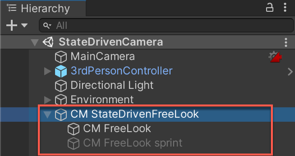
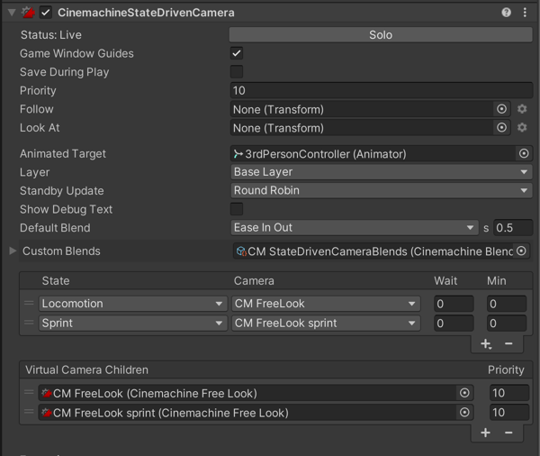

# Cinemachine State-Driven Camera

The __Cinemachine State-Driven Camera__ component activates a child Virtual Camera when an animation target changes states. For example, consider your avatar’s local-motion system and orbit camera.  Your game feels more alive to the player when the camera shakes more as your avatar runs. When the avatar walks, blend for example to a Virtual Camera with more damping.

The animation target for a State-Driven Camera is a GameObject with an [Animator](https://docs.unity3d.com/Manual/class-Animator.html) component controlled by an [Animator Controller](https://docs.unity3d.com/Manual/class-AnimatorController.html).

Assign normal __Look At__ and __Follow__ targets to each child Virtual Camera. If a child Virtual Camera has no __Look At__ or __Follow__ target, State-Driven camera uses its own, respective targets.

State-Driven Camera has a list that assigns child Virtual Cameras to animation states. You can define default and custom blends between the State-Driven children.

In the Inspector, the State-Driven camera lists its Virtual Camera children. Use this list to add and delete child Virtual Cameras, and assign priorities.

To create a State-Driven camera:

1. Set up the animation target GameObject to [control it with an Animator Controller](https://docs.unity3d.com/Manual/AnimatorControllers.html).

2. In the Unity menu, choose __GameObject > Cinemachine > State-Driven Camera__. A new State-Driven camera appears in the hierarchy with a new child Virtual Camera.

3. In the [Inspector](https://docs.unity3d.com/Manual/UsingTheInspector.html), assign the animation target you created in step 1 to the Animated Target property.

4. If needed, add more child VIrtual Cameras either by clicking + in Virtual Camera Children or dragging and dropping existing Virtual Cameras in the [Hierarchy](https://docs.unity3d.com/Manual/Hierarchy.html) window.

5. Use the __State__ to assign child Virtual Cameras to the animation states.

## Properties:

| **Property:** | **Function:** |
|:---|:---|
| __Solo__ | Toggles whether or not the Virtual Camera is temporarily live. Use this property to get immediate visual feedback in the [Game view](https://docs.unity3d.com/Manual/GameView.html) to adjust the Virtual Camera. |
| __Game Window Guides__ | Toggles the visibility of compositional guides in the Game view. These guides are available when Look At specifies a GameObject and the Aim section uses Composer or Group Composer, or when Follow specifies a target and the Body section uses Framing Composer. This property applies to all Virtual Cameras. |
| __Save During Play__ | Check to [apply the changes while in Play mode](CinemachineSavingDuringPlay.html).  Use this feature to fine-tune a Virtual Camera without having to remember which properties to copy and paste. This property applies to all Virtual Cameras. |
| __Priority__ | The importance of this State-Driven camera for choosing the next shot. A higher value indicates a higher priority. This property has no effect when using a State-Driven camera with Timeline. |
| __Look At__ | The default target GameObject that the children Virtual Camera move with. The State-Driven camera uses this target when the child does not specify this target. May be empty if all of the children define targets of their own. |
| __Follow__ | The default target GameObject to aim the Unity camera at. The State-Driven camera uses this target when the child does not specify this target. May be empty if all of the children define targets of their own. |
| __Animated Target__ | The GameObject that contains the Animator Controller. The State-Drive camera reacts to the animation state changes from this GameObject. |
| __Layer__ | The animation layer to observe in the Animated Target. |
| __Show Debug Text__ | Check to display a textual summary of the live Virtual Camera and blend in the game view. |
| __Default Blend__ | The blend which is used if you don’t explicitly define a blend between two Virtual Cameras. |
| __Custom Blends__ | The asset which contains custom settings for specific child blends. |
| __State__ | The list of animation state assignments for child Virtual Cameras.  |
| __Virtual Camera Children__ | The list of Virtual Cameras that are children of the State-Driven camera. |

